# How It Works: EOA Worker Transaction Processing

## Overview

The EOA (Externally Owned Account) Worker is a single worker per EOA:chain combination that processes all transactions for that specific EOA. It manages transaction lifecycle from queuing to confirmation, with robust error handling and nonce management.

## Core Architecture

### Data Structures

The worker maintains several key data structures:

- **`pending_txns`**: Queue of transaction IDs waiting to be sent
- **`success_txns`**: Sorted set mapping nonces to transaction hashes for sent transactions
- **`hash_to_id`**: Hash map from transaction hash to transaction ID
- **`tx_data`**: Hash map from transaction ID to full transaction JSON data
- **`borrowed_txns`**: Hash map for crash recovery of prepared transactions
- **`recycled_nonces`**: Sorted set of available recycled nonces
- **`optimistic_nonce`**: Next nonce to use for new transactions
- **`last_chain_nonce`**: Cached chain nonce for comparison
- **`eoa_health`**: Health status including funding state and last check timestamp

### Main Worker Loop

The worker runs in a continuous loop with three main phases:

1. **Recovery Phase**: Recovers any borrowed transactions from crashes
2. **Confirmation Phase**: Checks for mined transactions and handles failures
3. **Send Phase**: Sends new transactions while managing nonce allocation

## Transaction Flow Diagram

```mermaid
flowchart TD
    A["🚀 EOA Worker Start"] --> B["Main Worker Loop"]
    B --> C["1. Recover Borrowed State"]
    B --> D["2. Confirm Flow"]
    B --> E["3. Send Flow"]
    B --> F["💤 Sleep(WORKER_CYCLE_DELAY)"]
    F --> B

    %% Recovery Flow
    C --> C1["Check borrowed_txns"]
    C1 --> C2{Any borrowed<br/>transactions?}
    C2 -->|Yes| C3["For each borrowed tx:<br/>Rebroadcast prepared_tx"]
    C2 -->|No| D
    C3 --> C4["RPC Send Transaction"]
    C4 --> C5{Result Type?}
    C5 -->|Deterministic Failure| C6["❌ Requeue to pending_txns<br/>Add nonce to recycled_nonces"]
    C5 -->|Success/Indeterminate| C7["✅ Add to success_txns<br/>Update hash_to_id"]
    C6 --> C8["Remove from borrowed_txns"]
    C7 --> C8
    C8 --> C9{More borrowed<br/>transactions?}
    C9 -->|Yes| C3
    C9 -->|No| D

    %% Confirmation Flow
    D --> D1["Get current_chain_nonce"]
    D1 --> D2{Chain nonce<br/>changed?}
    D2 -->|No| E
    D2 -->|Yes| D3["Get pending hashes for<br/>nonces < current_chain_nonce"]
    D3 --> D4["For each pending hash:<br/>Get transaction receipt"]
    D4 --> D5{Receipt exists?}
    D5 -->|Yes| D6["✅ Transaction mined<br/>Add to confirmed_tx_ids<br/>Cleanup success_txns"]
    D5 -->|No| D7["❌ Transaction failed<br/>Add to failed_tx_ids"]
    D6 --> D8{More hashes<br/>to check?}
    D7 --> D8
    D8 -->|Yes| D4
    D8 -->|No| D9["Requeue failed transactions<br/>to pending_txns"]
    D9 --> D10["Update last_chain_nonce"]
    D10 --> E

    %% Send Flow
    E --> E1["Check EOA Health"]
    E1 --> E2{EOA funded?}
    E2 -->|No| B
    E2 -->|Yes| E3["Process Recycled Nonces"]
    E3 --> E4["Check in-flight count"]
    E4 --> E5{Too many<br/>in-flight?}
    E5 -->|Yes| B
    E5 -->|No| E6["Process New Transactions"]
    E6 --> B

    %% Process Recycled Nonces
    E3 --> E3A{recycled_nonces<br/>> MAX_RECYCLED?}
    E3A -->|Yes| E3B["🧹 Clear all recycled nonces"]
    E3A -->|No| E3C{recycled_nonces > 0<br/>AND pending_txns > 0?}
    E3B --> E4
    E3C -->|Yes| E3D["Pop min nonce<br/>Dequeue tx_id"]
    E3C -->|No| E3E{Still recycled<br/>nonces?}
    E3D --> E3F["Send transaction with nonce"]
    E3F --> E3C
    E3E -->|Yes| E3G["Send no-op transaction"]
    E3E -->|No| E4
    E3G --> E3E

    %% Process New Transactions
    E6 --> E6A{sent_count < max_count<br/>AND pending_txns > 0?}
    E6A -->|Yes| E6B["Dequeue tx_id<br/>Get next nonce"]
    E6A -->|No| B
    E6B --> E6C["Send transaction with nonce"]
    E6C --> E6D["Increment sent_count"]
    E6D --> E6A

    %% Send Transaction with Nonce
    E3F --> ST1["Get transaction data"]
    E6C --> ST1
    E3G --> ST1
    ST1 --> ST2["Prepare complete transaction"]
    ST2 --> ST3["Store in borrowed_txns"]
    ST3 --> ST4["RPC Send Transaction"]
    ST4 --> ST5{Result Type?}
    ST5 -->|Deterministic Failure| ST6["❌ Requeue tx_id<br/>Add nonce to recycled<br/>Mark EOA unfunded"]
    ST5 -->|Success/Indeterminate| ST7["✅ Add to success_txns<br/>Update hash_to_id"]
    ST6 --> ST8["Remove from borrowed_txns"]
    ST7 --> ST8
    ST8 --> ST9["Return to caller"]

    %% Health Check
    E1 --> E1A{Time since last<br/>check > threshold?}
    E1A -->|Yes| E1B["Get EOA balance"]
    E1A -->|No| E2
    E1B --> E1C["Update eoa_health.funded<br/>Update last_check"]
    E1C --> E2

    %% Styling
    classDef startEnd fill:#e1f5fe,stroke:#01579b,stroke-width:2px
    classDef process fill:#f3e5f5,stroke:#4a148c,stroke-width:2px
    classDef decision fill:#fff3e0,stroke:#e65100,stroke-width:2px
    classDef success fill:#e8f5e8,stroke:#2e7d32,stroke-width:2px
    classDef failure fill:#ffebee,stroke:#c62828,stroke-width:2px
    classDef cleanup fill:#f1f8e9,stroke:#558b2f,stroke-width:2px

    class A,B,F startEnd
    class C,D,E,E1,E3,E4,E6,C1,C3,C4,D1,D3,D4,D9,D10,E3D,E3F,E6B,E6C,E6D,ST1,ST2,ST3,ST4,E1B,E1C process
    class C2,C5,C9,D2,D5,D8,E2,E5,E3A,E3C,E3E,E6A,ST5,E1A decision
    class C7,D6,ST7 success
    class C6,D7,ST6 failure
    class C8,D9,E3B,ST8,ST9 cleanup
```

The above diagram illustrates the complete transaction processing flow. The worker operates in a continuous loop, processing three main phases sequentially.

## Detailed Phase Breakdown

### 1. Recovery Phase (`recover_borrowed_state`)

**Purpose**: Recover from crashes by handling any transactions that were prepared but not fully processed.

**Process**:

- Iterates through all transactions in `borrowed_txns`
- Rebroadcasts each prepared transaction to the RPC
- Classifies results:
  - **Deterministic failures**: Requeues transaction and recycles nonce
  - **Success/Indeterminate**: Assumes sent and adds to success tracking
- Cleans up borrowed state

**Key Insight**: This provides crash resilience by ensuring no prepared transactions are lost.

### 2. Confirmation Phase (`confirm_flow`)

**Purpose**: Identify completed transactions and handle failures.

**Process**:

- Compares current chain nonce with cached `last_chain_nonce`
- If unchanged, skips confirmation (no progress on chain)
- For progressed nonces, checks transaction receipts
- Categorizes results:
  - **Mined transactions**: Removes from tracking, adds to confirmed set
  - **Failed/Dropped transactions**: Adds to failed set for requeuing
- Requeues failed transactions (deduplicated against confirmed ones)
- Updates cached chain nonce

**Key Insight**: Uses nonce progression to efficiently identify which transactions need confirmation checks.

### 3. Send Phase (`send_flow`)

**Purpose**: Send new transactions while managing nonce allocation and capacity.

**Components**:

#### A. Health Check

- Periodically checks EOA balance
- Skips sending if insufficient funds
- Prevents wasteful RPC calls when EOA is unfunded

#### B. Recycled Nonce Processing

- **Overflow Protection**: Clears all recycled nonces if too many accumulate
- **Reuse Priority**: Fills recycled nonces before using fresh ones
- **No-op Transactions**: Sends empty transactions for unused recycled nonces

#### C. New Transaction Processing

- **Capacity Management**: Limits in-flight transactions to `MAX_IN_FLIGHT`
- **Fresh Nonce Allocation**: Uses optimistic nonce counter for new transactions
- **Batch Processing**: Sends multiple transactions up to available capacity

## Error Classification System

### Deterministic Failures

- Invalid signature
- Malformed transaction
- Invalid transaction format
- **Action**: Immediate requeue + nonce recycling

### Success Cases

- Explicit success response
- "already known" (duplicate)
- "nonce too low" (already mined)
- **Action**: Add to success tracking

### Indeterminate Cases

- Network timeouts
- Temporary RPC failures
- Unknown errors
- **Action**: Assume sent (optimistic approach)

## Nonce Management Strategy

### Optimistic Nonce Counter

- Maintains local counter independent of chain state
- Increments immediately when sending transactions
- Allows parallel transaction preparation

### Recycled Nonce Pool

- Reuses nonces from failed transactions
- Prevents nonce gaps in the sequence
- Bounded size to prevent memory leaks

### Chain Nonce Synchronization

- Periodically syncs with actual chain state
- Used for confirmation and capacity calculations
- Handles chain reorganizations gracefully

## Key Design Decisions

### 1. Single Worker Per EOA:Chain

- **Benefit**: Eliminates nonce conflicts between workers
- **Trade-off**: Limits parallelism but ensures consistency

### 2. Optimistic Sending

- **Benefit**: Higher throughput by not waiting for confirmations
- **Trade-off**: Requires robust error handling and recovery

### 3. Borrowed Transaction Pattern

- **Benefit**: Crash resilience without complex state management
- **Trade-off**: Slight overhead for state tracking

### 4. Bounded In-Flight Transactions

- **Benefit**: Prevents memory leaks and excessive RPC usage
- **Trade-off**: May limit throughput during high-volume periods

### 5. Recycled Nonce Cleanup

- **Benefit**: Prevents unbounded memory growth
- **Trade-off**: May create temporary nonce gaps

## Configuration Parameters

- **`MAX_IN_FLIGHT`**: Maximum concurrent unconfirmed transactions
- **`MAX_RECYCLED_NONCES`**: Maximum recycled nonces before cleanup
- **`WORKER_CYCLE_DELAY`**: Sleep time between worker iterations
- **`HEALTH_CHECK_INTERVAL`**: Frequency of EOA balance checks
- **`MIN_BALANCE_THRESHOLD`**: Minimum balance to consider EOA funded

## Monitoring and Observability

The worker exposes several metrics for monitoring:

- **Queue Depth**: Size of `pending_txns` queue
- **In-Flight Count**: `optimistic_nonce - last_chain_nonce`
- **Success Rate**: Ratio of confirmed to sent transactions
- **Recycled Nonce Count**: Size of recycled nonce pool
- **Health Status**: EOA funding state and last check time

## Failure Modes and Recovery

### Common Failure Scenarios

1. **EOA Runs Out of Funds**

   - **Detection**: Balance check during health verification
   - **Recovery**: Automatic retry once funds are restored

2. **Network Partitions**

   - **Detection**: RPC call failures during any phase
   - **Recovery**: Continues processing with cached state until network restored

3. **Worker Crashes**

   - **Detection**: Restart detection during recovery phase
   - **Recovery**: Borrowed transaction rebroadcast ensures no loss

4. **Chain Reorganizations**
   - **Detection**: Chain nonce inconsistencies
   - **Recovery**: Confirmation phase handles dropped transactions

This architecture provides a robust, scalable solution for managing EOA transactions with strong consistency guarantees and graceful failure handling.
