# How It Works: EOA Worker Transaction Processing

## Overview

The EOA (Externally Owned Account) Worker is a single worker per EOA:chain combination that processes all transactions for that specific EOA. It manages transaction lifecycle from queuing to confirmation, with robust error handling, nonce management, gas bumping, and webhook notifications.

## Core Architecture

### Data Structures

The worker maintains several key data structures in Redis:

- **`pending_transactions`**: ZSET of transaction IDs waiting to be sent, scored by queued timestamp
- **`submitted_transactions`**: ZSET mapping nonces to "hash:transaction_id" pairs for sent transactions  
- **`transaction_hash_to_id`**: Hash map from transaction hash to transaction ID
- **`transaction_data`**: Hash maps storing full transaction data with user requests and receipts
- **`transaction_attempts`**: Lists storing all attempts (including gas bumps) for each transaction
- **`borrowed_transactions`**: Hash map for crash recovery of prepared transactions
- **`recycled_nonces`**: ZSET of available recycled nonces from failed transactions
- **`optimistic_transaction_count`**: Counter for next nonce to use for new transactions
- **`last_transaction_count`**: Cached chain transaction count for comparison
- **`eoa_health`**: Health status including balance, thresholds, and movement tracking

### Main Worker Execution

The worker runs as a TWMQ job with three main phases executed once per job:

1. **Recovery Phase**: Recovers any borrowed transactions from crashes
2. **Confirmation Phase**: Checks for mined transactions, handles gas bumping, and manages nonce synchronization
3. **Send Phase**: Sends new transactions while managing nonce allocation and capacity

Worker execution is scheduled by the TWMQ job queue system. TWMQ acts like a "distributed async scheduler" for each `eoa:chain` "green thread". These threads suspend themselves when there is no work to do, and ask to be rescheduled when more work is available.

## Transaction Flow Diagram

```mermaid
flowchart TD
    A["🚀 EOA Worker Job Start"] --> B["Acquire EOA Lock Aggressively"]
    B --> C["1. Recover Borrowed State"]
    C --> D["2. Confirm Flow"]
    D --> E["3. Send Flow"]
    E --> F["Check Work Remaining"]
    F --> G{Work Remaining?}
    G -->|Yes| H["⏰ Requeue Job (2s delay)"]
    G -->|No| I["✅ Job Complete"]
    H --> J["Release Lock"]
    I --> J
    J --> K["🏁 Job End"]

    %% Recovery Flow
    C --> C1["Get borrowed_transactions"]
    C1 --> C2{Any borrowed<br/>transactions?}
    C2 -->|Yes| C3["For each borrowed tx:<br/>Rebroadcast signed_transaction"]
    C2 -->|No| D
    C3 --> C4["RPC Send Transaction"]
    C4 --> C5{Result Type?}
    C5 -->|Deterministic Failure| C6["❌ Move to pending<br/>Add nonce to recycled"]
    C5 -->|Success/Indeterminate| C7["✅ Move to submitted<br/>Update hash mappings"]
    C6 --> C8["Remove from borrowed"]
    C7 --> C8
    C8 --> C9{More borrowed<br/>transactions?}
    C9 -->|Yes| C3
    C9 -->|No| D

    %% Confirmation Flow
    D --> D1["Get current chain tx_count"]
    D1 --> D2{Chain tx_count<br/>progressed?}
    D2 -->|No| D2A["Check if stalled (5min timeout)"]
    D2A --> D2B{Nonce stalled<br/>& submitted > 0?}
    D2B -->|Yes| D2C["🚀 Attempt Gas Bump"]
    D2B -->|No| E
    D2C --> E
    D2 -->|Yes| D3["Get submitted txs below tx_count"]
    D3 --> D4["For each submitted tx:<br/>Get transaction receipt"]
    D4 --> D5{Receipt exists?}
    D5 -->|Yes| D6["✅ Transaction confirmed<br/>Queue webhook<br/>Cleanup submitted"]
    D5 -->|No| D7["❌ Transaction replaced<br/>Move to pending"]
    D6 --> D8{More txs<br/>to check?}
    D7 --> D8
    D8 -->|Yes| D4
    D8 -->|No| D9["Update cached tx_count<br/>Update health timestamps"]
    D9 --> E

    %% Send Flow  
    E --> E1["Check EOA Health"]
    E1 --> E2{Balance ><br/>threshold?}
    E2 -->|No| E2A["Update balance if stale"]
    E2A --> E2B{Still insufficient?}
    E2B -->|Yes| F
    E2B -->|No| E3
    E2 -->|Yes| E3["Process Recycled Nonces"]
    E3 --> E4["Check remaining recycled"]
    E4 --> E5{All recycled<br/>processed?}
    E5 -->|No| F
    E5 -->|Yes| E6["Process New Transactions"]
    E6 --> F

    %% Process Recycled Nonces
    E3 --> E3A["Clean recycled nonces<br/>(remove if > MAX_RECYCLED_THRESHOLD)"]
    E3A --> E3B{recycled_nonces > 0<br/>AND pending > 0?}
    E3B -->|Yes| E3C["Get pending txs matching count"]
    E3B -->|No| E3D{Still have<br/>recycled nonces?}
    E3C --> E3E["Build & sign transactions"]
    E3E --> E3F["Move to borrowed atomically"]
    E3F --> E3G["Send transactions via RPC"]
    E3G --> E3H["Process send results"]
    E3H --> E3A
    E3D -->|Yes| E3I["Send noop transactions<br/>for unused nonces"]
    E3D -->|No| E4
    E3I --> E4

    %% Process New Transactions
    E6 --> E6A["Get inflight budget"]
    E6A --> E6B{Budget > 0<br/>AND pending > 0?}
    E6B -->|Yes| E6C["Get pending txs up to budget"]
    E6B -->|No| F
    E6C --> E6D["Build & sign with sequential nonces"]
    E6D --> E6E["Move to borrowed with incremented nonces"]
    E6E --> E6F["Send transactions via RPC"]
    E6F --> E6G["Process send results"]
    E6G --> E6A

    %% Gas Bump Flow
    D2C --> GB1["Get submitted txs for stalled nonce"]
    GB1 --> GB2{Any txs found<br/>for nonce?}
    GB2 -->|No| GB3["Send noop transaction"]
    GB2 -->|Yes| GB4["Find newest transaction"]
    GB4 --> GB5["Rebuild with 20% gas increase"]
    GB5 --> GB6["Sign bumped transaction"]
    GB6 --> GB7["Add gas bump attempt"]
    GB7 --> GB8["Send bumped transaction"]
    GB3 --> E
    GB8 --> E

    %% Health Check Details
    E1 --> E1A["Get cached health data"]
    E1A --> E1B{Health data<br/>exists?}
    E1B -->|No| E1C["Initialize health from chain balance"]
    E1B -->|Yes| E2
    E1C --> E1D["Save initial health data"]
    E1D --> E2

    %% Styling
    classDef startEnd fill:#e1f5fe,stroke:#01579b,stroke-width:2px
    classDef process fill:#f3e5f5,stroke:#4a148c,stroke-width:2px
    classDef decision fill:#fff3e0,stroke:#e65100,stroke-width:2px
    classDef success fill:#e8f5e8,stroke:#2e7d32,stroke-width:2px
    classDef failure fill:#ffebee,stroke:#c62828,stroke-width:2px
    classDef cleanup fill:#f1f8e9,stroke:#558b2f,stroke-width:2px
    classDef gasbump fill:#e3f2fd,stroke:#1565c0,stroke-width:2px

    class A,I,J,K startEnd
    class B,C,D,E,F,C1,C3,C4,D1,D3,D4,D9,E3A,E3C,E3E,E3F,E3G,E3H,E6C,E6D,E6E,E6F,E6G,GB4,GB5,GB6,GB7,GB8,E1A,E1C,E1D,E2A process
    class C2,C5,C9,D2,D2B,D5,D8,E2,E2B,E5,E3B,E3D,E6B,GB2,E1B decision
    class C7,D6 success
    class C6,D7 failure
    class C8,H,E3I cleanup
    class D2C,GB1,GB3 gasbump
```

The above diagram illustrates the complete transaction processing flow within a single job execution. The worker operates using the TWMQ job queue system, processing available work and requeueing itself if more work remains.

## Detailed Phase Breakdown

### 1. Recovery Phase (`recover_borrowed_state`)

**Purpose**: Recover from crashes by handling any transactions that were prepared but not fully processed.

**Process**:

- Retrieves all transactions from `borrowed_transactions` hashmap
- Sorts by nonce to ensure proper ordering during rebroadcast
- Rebroadcasts each signed transaction in parallel to the RPC
- Classifies results using the sophisticated error classification system
- Uses batch processing to atomically move transactions to final states
- Queues webhook notifications for state changes

**Key Insight**: Provides crash resilience while maintaining transaction ordering and proper state transitions. "Borrowed transactions" are funcationally a write-ahead-log for the worker.

### 2. Confirmation Phase (`confirm_flow`) 

**Purpose**: Identify completed transactions, handle gas bumping for stalled nonces, and maintain nonce synchronization.

**Process**:

- Fetches current chain transaction count and compares with cached value
- **No Progress Path**: If no nonce advancement, checks for stalled transactions
  - If a nonce is stalled for >5 minutes with pending transactions, attempts gas bumping
  - Finds the newest transaction for the stalled nonce and rebuilds with 20% gas increase
  - If no transactions exist for the nonce, sends a noop transaction
- **Progress Path**: If nonces advanced, processes confirmations
  - Fetches receipts for all submitted transactions below current transaction count
  - Categorizes as confirmed (has receipt) or replaced (no receipt)
  - Atomically cleans confirmed transactions and updates mappings
  - Updates cached transaction count and health timestamps
- Queues webhook notifications for all state changes

**Key Insight**: Combines confirmation checking with proactive gas bumping to prevent transaction stalls.

### 3. Send Phase (`send_flow`)

**Purpose**: Send new transactions while managing nonce allocation, capacity limits, and EOA health.

**Components**:

#### A. Health Check and Balance Management

- Retrieves or initializes EOA health data with balance, thresholds, and timestamps
- Updates balance if stale (>5 minutes since last check)
- Compares balance against dynamic threshold (updated based on transaction failures)
- Skips sending if balance is insufficient

#### B. Recycled Nonce Processing

- **Overflow Protection**: Cleans recycled nonces if count exceeds `MAX_RECYCLED_THRESHOLD` (50)
- **Batch Processing**: Matches recycled nonces with pending transactions
- **Parallel Preparation**: Builds and signs multiple transactions concurrently
- **Error Handling**: Filters preparation failures and handles balance threshold updates
- **Atomic State Transitions**: Uses WATCH/MULTI/EXEC for race-free state changes
- **Noop Handling**: Sends empty transactions for unused recycled nonces

#### C. New Transaction Processing

- **Budget Calculation**: Determines available capacity using `MAX_INFLIGHT_PER_EOA` (100)
- **Sequential Nonce Assignment**: Assigns consecutive nonces starting from optimistic counter
- **Batch Processing**: Processes multiple transactions up to available budget
- **Atomic Nonce Management**: Atomically increments optimistic counter during state transitions
- **Retry Logic**: Fixed iteration limit prevents infinite loops during high failure rates

## Advanced Features

### Gas Bumping System

**Trigger Conditions**:
- Nonce hasn't moved for >5 minutes (`NONCE_STALL_TIMEOUT`)
- Submitted transactions exist for the stalled nonce

**Process**:
1. Identifies newest transaction for the stalled nonce
2. Rebuilds transaction with 20% gas price increase
3. Signs and records as new attempt in transaction history
4. Broadcasts bumped transaction
5. Falls back to noop transaction if no transactions exist

### Atomic State Management

**Lock Acquisition**:
- Aggressive lock takeover for stalled workers
- Redis-based distributed locking per EOA:chain combination

**Transaction Safety**:
- All state changes use Redis WATCH/MULTI/EXEC for atomicity
- Retry logic with exponential backoff for contention
- Lock ownership validation before every operation

### Webhook Integration

**Event Types**:
- Transaction submitted
- Transaction confirmed  
- Transaction failed
- Transaction replaced

**Delivery**:
- Queued via TWMQ for reliable delivery
- Supports multiple webhook endpoints per transaction
- Includes full transaction data and receipts

## Error Classification System

### Deterministic Failures
- Invalid transaction parameters
- Insufficient balance (below threshold)
- Transaction simulation failures
- **Action**: Immediate failure + webhook notification

### Success Cases  
- Explicit RPC success
- "already known" (duplicate submission)
- "nonce too low" (already mined)
- **Action**: Move to submitted state

### Indeterminate Cases
- Network timeouts
- Temporary RPC failures  
- Unknown RPC errors
- **Action**: Assume sent (optimistic approach)

### Balance Threshold Management
- Dynamically updated based on transaction failures
- Prevents wasteful RPC calls when EOA lacks funds
- Automatically refreshed when transactions fail due to balance

## Nonce Management Strategy

### Optimistic Transaction Count
- Tracks next available nonce independent of chain state
- Atomically incremented when moving transactions to borrowed state
- Enables parallel transaction preparation

### Cached Transaction Count
- Periodically synced with actual chain state during confirmation
- Used for inflight budget calculations and confirmation checks
- Updated atomically with health timestamps

### Recycled Nonce Pool
- Reuses nonces from definitively failed transactions
- Bounded size with automatic cleanup at `MAX_RECYCLED_THRESHOLD`
- Priority processing before new nonces

### Nonce Reset Protection
- Automatic reset when sync issues detected
- Tracks reset history in health data for monitoring
- Prevents state corruption during chain reorganizations

## Key Design Decisions

### 1. Job-Based Execution
- **Benefit**: Natural backpressure and resource management via TWMQ
- **Trade-off**: Latency depends on queue processing speed

### 2. Aggressive Lock Acquisition  
- **Benefit**: Handles worker crashes and stalls gracefully
- **Trade-off**: Potential work duplication during handoffs

### 3. Atomic State Transitions
- **Benefit**: Strong consistency guarantees even during failures
- **Trade-off**: Increased complexity and potential retry overhead

### 4. Batch Processing
- **Benefit**: High throughput via parallel RPC calls and atomic state updates
- **Trade-off**: More complex error handling and state management

### 5. Gas Bumping Integration
- **Benefit**: Proactive handling of network congestion
- **Trade-off**: Additional RPC overhead and complexity

### 6. Dynamic Balance Thresholds
- **Benefit**: Adapts to changing gas prices and network conditions
- **Trade-off**: Potential for false positives during price volatility

## Configuration Parameters

- **`MAX_INFLIGHT_PER_EOA`**: 100 - Maximum concurrent unconfirmed transactions
- **`MAX_RECYCLED_THRESHOLD`**: 50 - Maximum recycled nonces before cleanup  
- **`TARGET_TRANSACTIONS_PER_EOA`**: 10 - Fleet management target
- **`MIN_TRANSACTIONS_PER_EOA`**: 1 - Fleet management minimum
- **`NONCE_STALL_TIMEOUT`**: 300,000ms (5 minutes) - Gas bump trigger
- **`HEALTH_CHECK_INTERVAL`**: 300s (5 minutes) - Balance refresh interval

## Monitoring and Observability

The worker exposes several metrics through the job result:

- **Queue Metrics**: Pending, borrowed, and submitted transaction counts
- **Nonce Metrics**: Recycled nonce count and optimistic nonce position
- **Processing Metrics**: Transactions recovered, confirmed, failed, and sent per job
- **Health Metrics**: Balance status, last check timestamp, nonce reset history

## Failure Modes and Recovery

### Common Failure Scenarios

1. **EOA Runs Out of Funds**
   - **Detection**: Balance check against dynamic threshold
   - **Recovery**: Automatic retry when balance threshold is met

2. **Network Partitions**
   - **Detection**: RPC call failures during any phase
   - **Recovery**: Job requeue with exponential backoff

3. **Worker Crashes**
   - **Detection**: Lock timeout and aggressive takeover
   - **Recovery**: Borrowed transaction rebroadcast ensures no loss

4. **Nonce Stalls**
   - **Detection**: Time-based stall detection (5-minute timeout)
   - **Recovery**: Automatic gas bumping or noop transactions

5. **Chain Reorganizations**
   - **Detection**: Chain transaction count inconsistencies
   - **Recovery**: Confirmation phase handles dropped transactions

6. **State Corruption**
   - **Detection**: Optimistic nonce validation failures
   - **Recovery**: Automatic nonce reset to chain state

This architecture provides a robust, scalable solution for managing EOA transactions with strong consistency guarantees, proactive congestion handling, and comprehensive failure recovery mechanisms.
